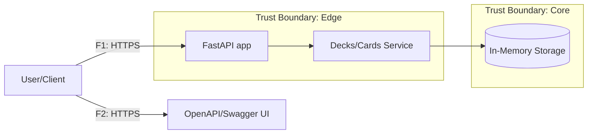

# DFD — Data Flow Diagram

## Diagram (Mermaid)

## Flows
| ID | Source → Target | Channel/Protocol | Data/PII | Notes |
|----|------------------|------------------|----------|-------|
| F1 | U → API         | HTTPS            | generic  | Requests to `/decks`, `/cards`, `/health` |
| F2 | U → Docs        | HTTPS            | none     | Read-only OpenAPI UI |
| F3 | API → SVC       | in-proc call     | payloads | Pydantic validation, error envelope |
| F4 | SVC → MEM       | memory           | cards PI | In-memory lists emulate storage |
